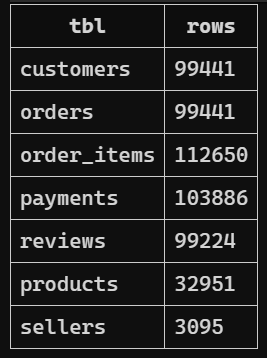
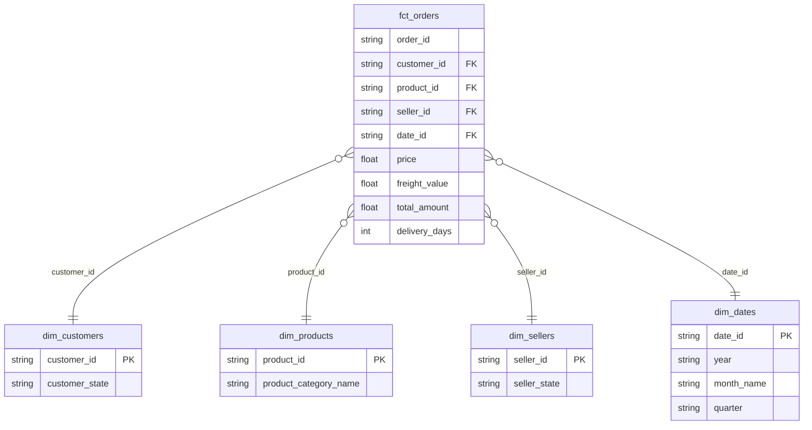
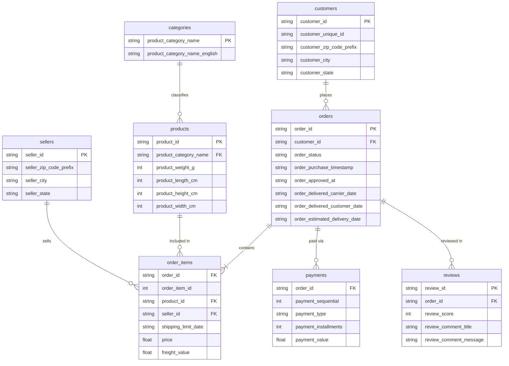
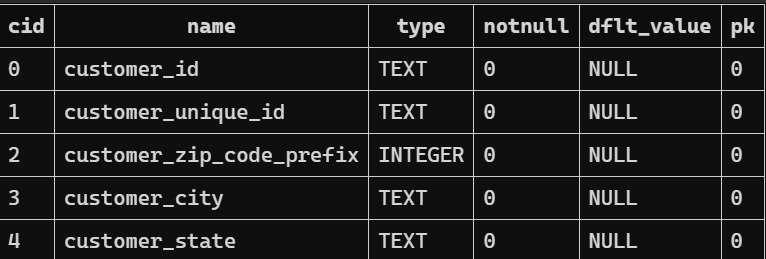
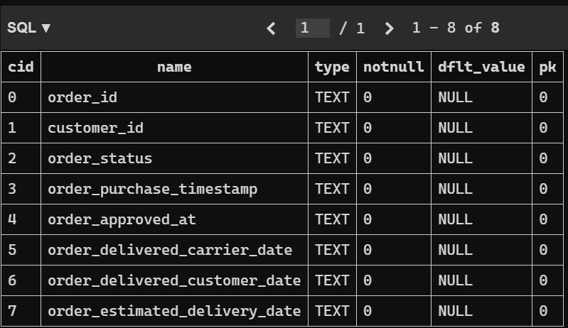
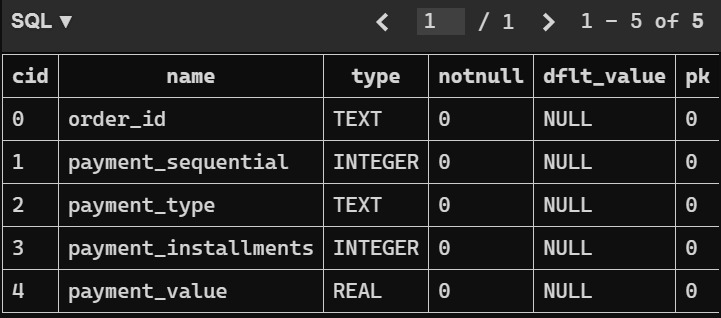
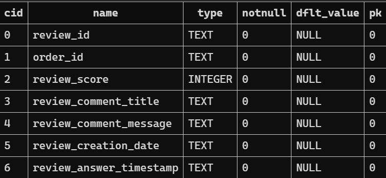
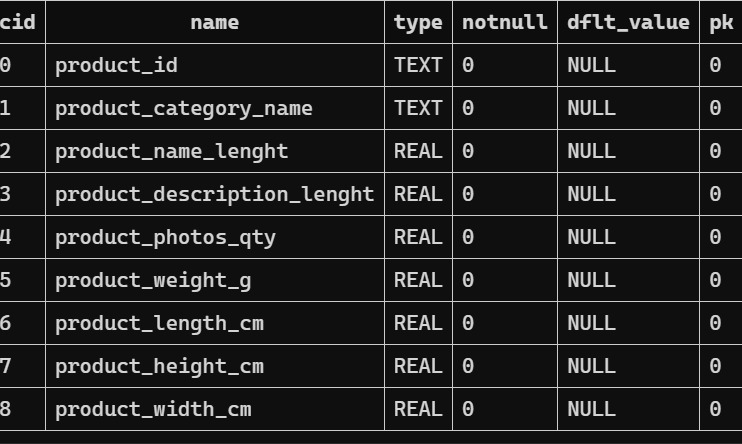
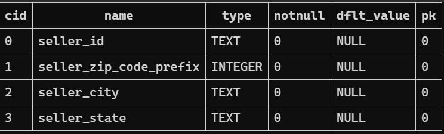

# Olist Brazilian E-Commerce - SQL Analysis


## Overview
End to end data analysis of the Olist Brazilian E-Commerce dataset: 100k orders placed between 2016 and 2018. The project covers data ingestion, exploration, quality checks, cleaning, and business intelligence queries using SQL (SQLite) and Python.
---

## Dataset
Source: [Brazilian E-Commerce Public Dataset by Olist](https://www.kaggle.com/datasets/olistbr/brazilian-ecommerce) - Kaggle

9 tables / 7 entities:

| Table | Rows |
|---|---|
| customers | 99,441 |
| orders | 99,441 |
| order_items | 112,650 |
| payments | 103,886 |
| reviews | 99,224 |
| products | 32,951 |
| sellers | 3,095 |



---

## Data Model (Star Schema)

Built with dbt on top of the raw dataset.



---

## Schema (Raw Dataset)



---

## Project Structure

```
olist-ecommerce-sql-analysis/
├── data/                  # Raw CSVs (not tracked - see .gitignore)
├── queries/
│   └── ETL.sql            # Full pipeline: exploration, cleaning, analysis
├── schema/
│   └── ERD.md             # Entity relationship diagram
├── Screenshots/           # Query results
├── setup_db.py            # Loads CSVs into SQLite (olist.db)
└── README.md
```

---

## How to Run

**1. Download the dataset from Kaggle and place the CSVs in `data/`**

**2. Install dependencies**
```bash
pip install pandas
```

**3. Create the database**
```bash
python setup_db.py
```

**4. Open `queries/ETL.sql` in VS Code**
- Install the [SQLite extension](https://marketplace.visualstudio.com/items?itemName=alexcvzz.vscode-sqlite)
- `Ctrl+Shift+P` → SQLite: Open Database → select `olist.db`
- Run each query block individually

---

## Section 1 | Exploration & Quality Check

### Schema Inspection

PRAGMA queries confirm column names, data types, and structure across all 7 tables.









### Key Quality Findings

|     Table     |                 Issue                 |                   Decision                  |
|---------------|---------------------------------------|---------------------------------------------|
| orders        | 2,965 null delivery dates             | Filter `WHERE order_status = 'delivered'`   |
| orders        | 8 rows status='delivered' but no date | Exclude with `IS NOT NULL`                  |
| products      | 610 null categories                   | Replace with `'uncategorized'` via COALESCE |
| reviews       | 87,656 null comment titles            | Optional field - ignored in analysis        |
| customer_city | Typos and inconsistent formats        | Not used  `customer_state` used instead    |
| seller_city   | 22 rows with non-standard formats     | Not used in analysis                        |

---

## Section 2 - Data Cleaning

Two views created to address quality issues:

- **`products_clean`** - replaces NULL category with `'uncategorized'`
- **`sellers_clean`** (CTE) - assigns readable alias `Seller N` since seller names are anonymized UUIDs

---

## Section 3 - Analysis Queries

### Q1: Monthly Revenue Trend
How has revenue evolved month over month?


---

### Q2: Revenue by State
Which Brazilian states generate the most revenue?


---

### Q3: Top Categories by Revenue
Which product categories drive the most sales?


---

### Q4: Top Sellers by Revenue
Who are the top 10 performing sellers?


---

### Q5: Customer Satisfaction by Category
Which categories have the best and worst ratings?


---

### Q6: Delivery Performance
Average delivery days by state and how proximity between seller and buyer impacts speed.


**Same-state deliveries are consistently faster.** When seller and customer are in the same state, average delivery drops to 6–11 days. SP→SP alone accounts for 35,420 orders at 7.9 days average.


---

## Tools
- **SQLite** | database engine
- **Python + pandas** | CSV ingestion
- **VS Code** | SQL editor (SQLite extension)
- **dbt** | data transformation and star schema modeling
- **Power BI** | dashboard


