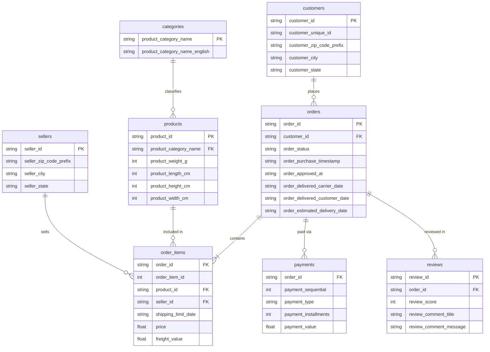

```mermaid
erDiagram
    customers {
        string customer_id PK
        string customer_unique_id
        string customer_zip_code_prefix
        string customer_city
        string customer_state
    }
    orders {
        string order_id PK
        string customer_id FK
        string order_status
        string order_purchase_timestamp
        string order_approved_at
        string order_delivered_carrier_date
        string order_delivered_customer_date
        string order_estimated_delivery_date
    }
    order_items {
        string order_id FK
        int    order_item_id
        string product_id FK
        string seller_id FK
        string shipping_limit_date
        float  price
        float  freight_value
    }
    payments {
        string order_id FK
        int    payment_sequential
        string payment_type
        int    payment_installments
        float  payment_value
    }
    reviews {
        string review_id PK
        string order_id FK
        int    review_score
        string review_comment_title
        string review_comment_message
    }
    products {
        string product_id PK
        string product_category_name FK
        int    product_weight_g
        int    product_length_cm
        int    product_height_cm
        int    product_width_cm
    }
    sellers {
        string seller_id PK
        string seller_zip_code_prefix
        string seller_city
        string seller_state
    }
    categories {
        string product_category_name PK
        string product_category_name_english
    }

    customers   ||--o{ orders      : "places"
    orders      ||--|{ order_items : "contains"
    orders      ||--o{ payments    : "paid via"
    orders      ||--o{ reviews     : "reviewed in"
    products    ||--o{ order_items : "included in"
    sellers     ||--o{ order_items : "sells"
    categories  ||--o{ products    : "classifies"
```
